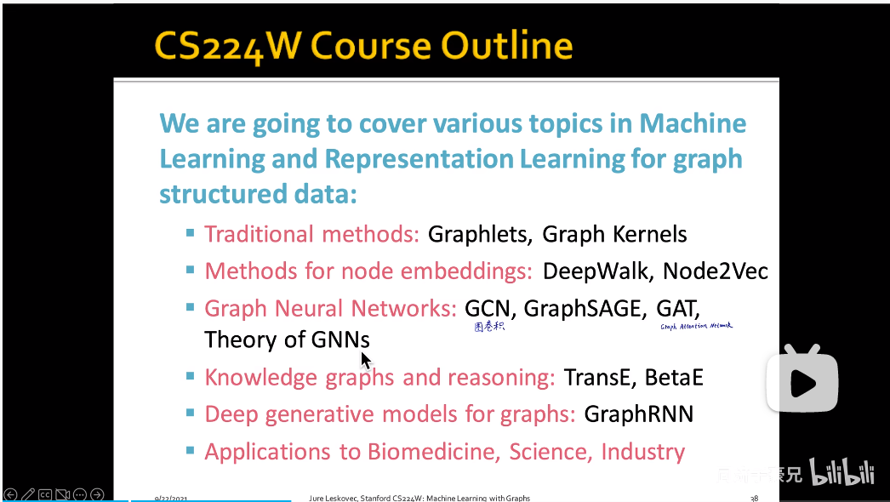
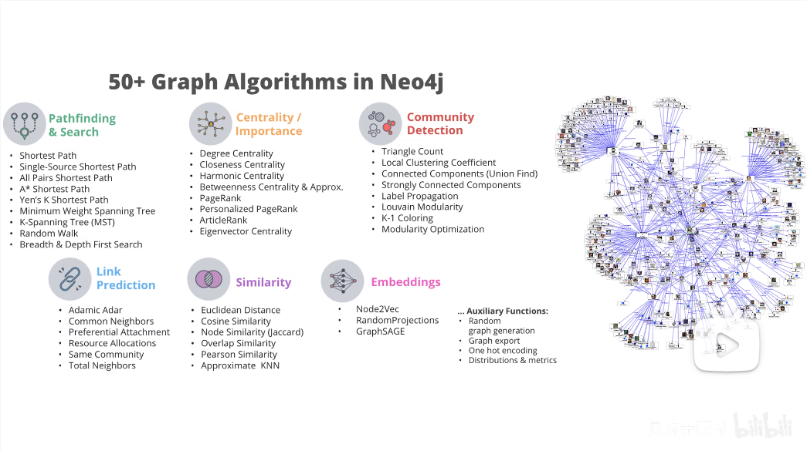

# Task01：图机器学习导论

## 1.图无处不在
在自然界中，图这一概念是普遍存在的。只要能抽象出“节点”和“连接”，都能够建立图模型。

## 2.课程概述
对传统的不带关联的样本，技术已经非常成熟了。图神经网络则用于处理图数据（带关联）。

图表示学习：使用图神经网络，将图上的节点映射为一个低维向量

常用编程工具：
- PyG
- GraphGym
- NetworkX
- DGL
- AntV G6
- Echarts
- GraphXR
图数据库：
- Neo4j

## 3.应用

推荐系统：实质上是link prediction，由已知的（商品→用户）连接去推测出未知的连接。
药物发现：对图进行分类。既可以生成新分子，也可以在已有基础上进行优化