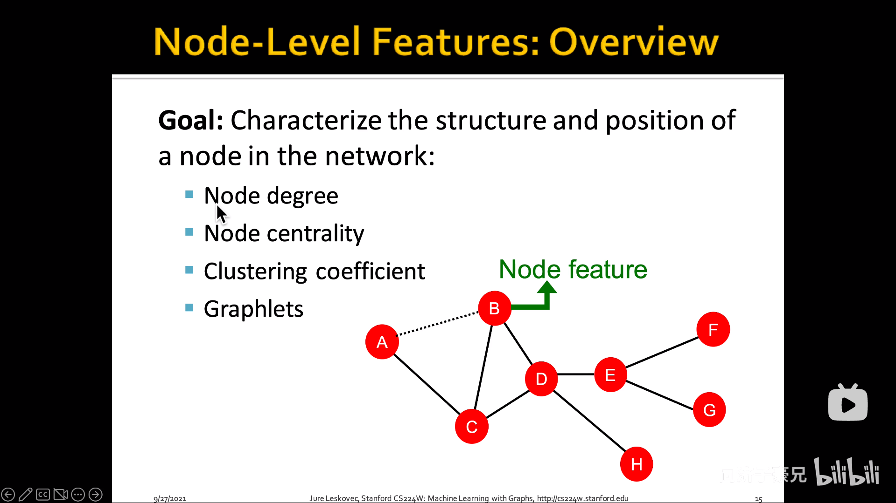
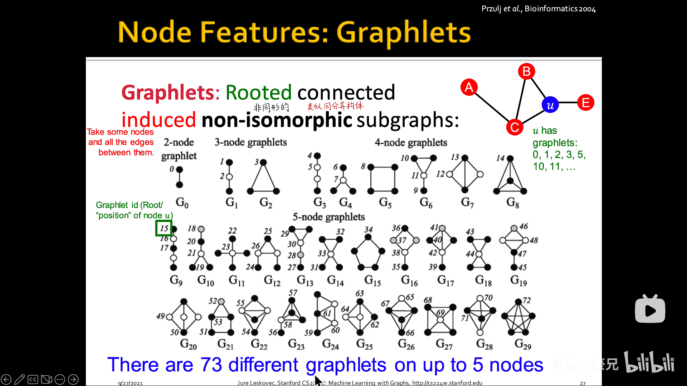
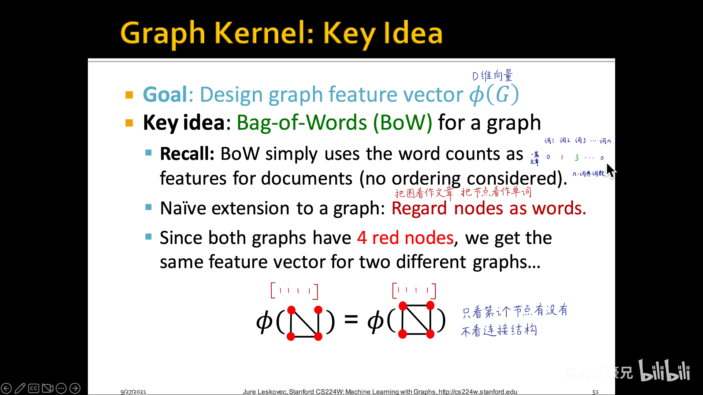
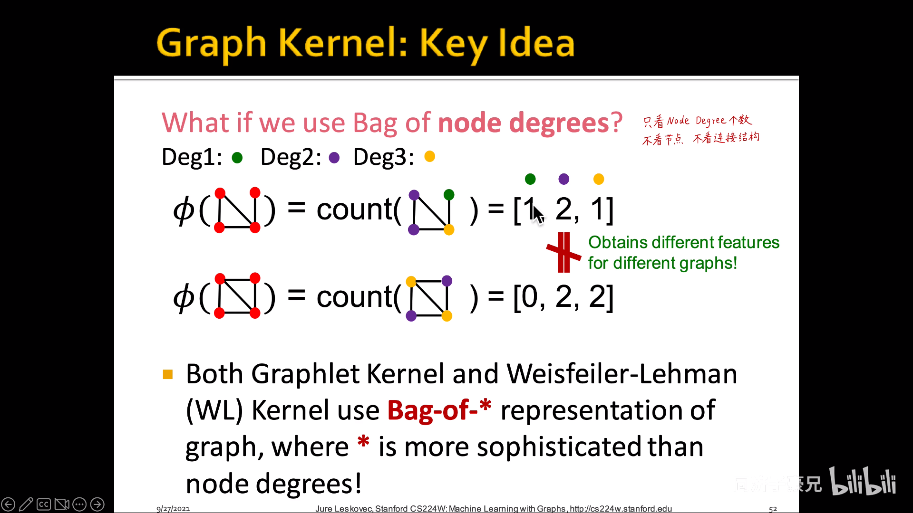
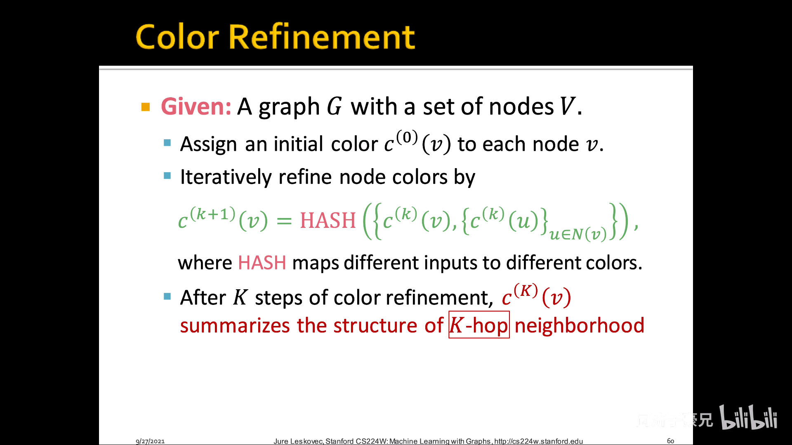

# Task02 图的基本表示和特征工程

## 1.图的基本表示
$Graph=(Vertexes, Edges)$
按连接结构：
- 有向图：in = out
  >甚至可以直接用node degree来反应一个node的重要程度
- 无向图

按内容：
- 异质图：比如知识图谱

表示方法：
- 邻接矩阵（实际应用中很稀疏）
- 连接列表（edge list）：只记录存在连接的节点对
- 邻接列表：记录和每个节点相邻的节点

## 2.传统图机器学习的特征工程
不讲属性特征，只讲连接特征（属性特征后面图神经网络讲，侧重于图结构信息）

### 2.1 节点层面的特征工程

- Node Degree
- Degree Centrality
  - Eigenvector Centrality
  
  - Betweenness Centrality（交通咽喉）
  
  - Closeness Centrality（去哪儿都近）
  
  - Clustering Coefficient（有多抱团）
  
- Graphlets

### 2.2 连接层面的特征工程
recap：link prediction是通过已知连接补全未知连接

直接提取link本身的特征，而不是把两端节点特征拼接！

- Distance-Based Features
- Local Neighborhood Overlap
  - 如果两个节点没有共同好友，就不好用了
  
- Katz Index：节点u和节点v之间长度为K的路径个数
  

### 2.3 全图层面的特征工程

graphlet kernel 子图匹配算力消耗过大，不常用。Subgraph isomorphism test is NP-hard.

Color Refinement：K步捕捉K跳，和后续要讲的图神经网络有类似思想

