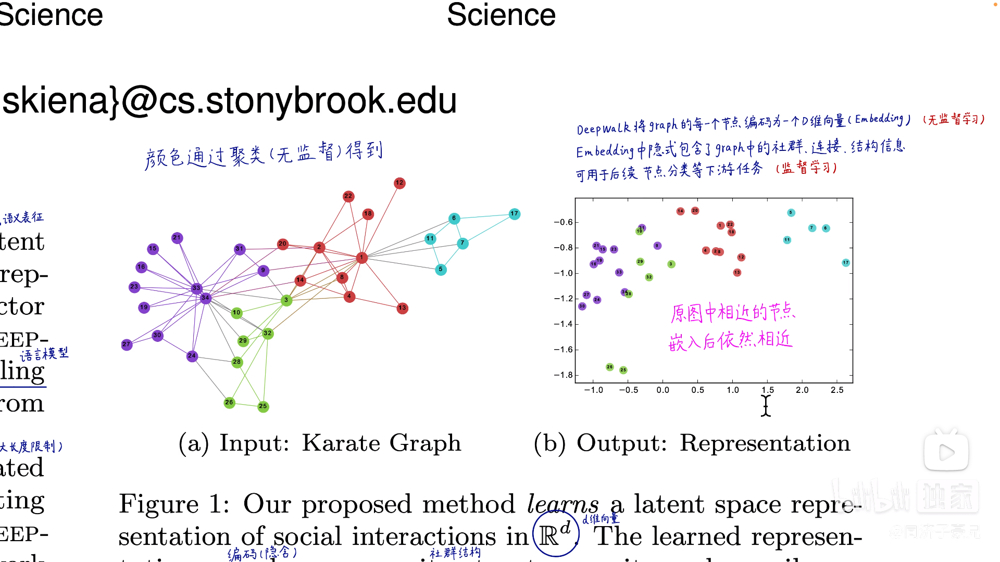
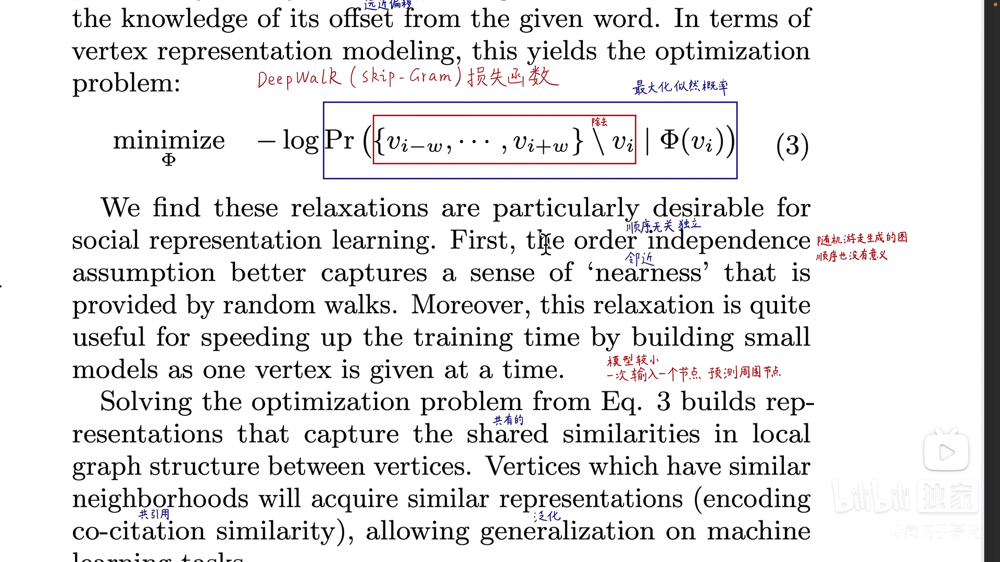
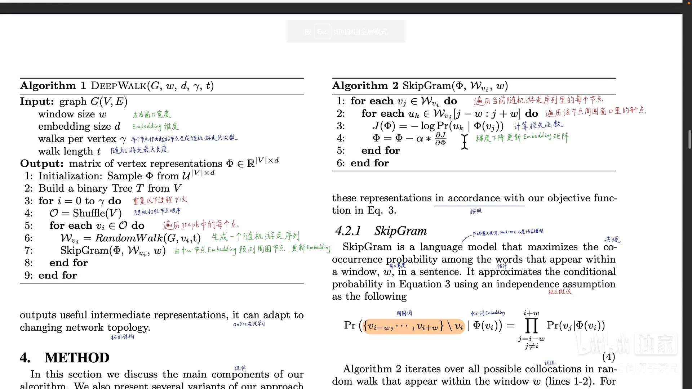

# task05：DeepWalk、Node2Vec论文精读

## 1.DeepWalk论文
- Motivation：为图中节点学习出一个低维向量表示（embedding）
  
- Method：类比自然语言处理的Word2Vec，通过在图上采样随机游走序列
  - 每个序列可以看作“一个句子”
  - 每个节点就相当于“一个词”
  - 所有节点就是“vocabulary”
- Optimization
  
  - SkipGram
  - Hierarchical Softmax
  

## 2.Node2Vec论文
有偏的随机游走（Biased Walk）
- 在DeepWalk完全随机游走的基础上，Node2Vec增加p、q参数，实现有偏随机游走
- DFS深度优先搜索，相邻的节点，向量相近
- BFS广度优先搜索，相同功能角色的节点，向量相近
- DeepWalk是Node2Vec在p=q=1的特例
